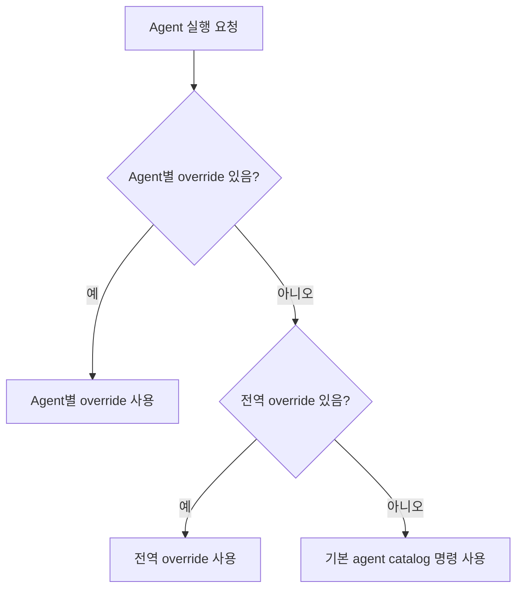

# ACP Agent 실행 명령 Override

## 개요

`agentic-workbench`는 ACP agent 실행 시 기본 agent catalog 명령을 사용한다.
이 기능은 사용자가 로컬 환경에 맞는 실행 명령을 설정 페이지에서 저장하고,
agent 실행 시 저장된 명령을 우선 적용할 수 있게 한다.

## 우선순위

실행 명령은 다음 순서로 결정한다.

1. Agent별 override
2. 전역 override
3. 기본 agent catalog 명령

Agent별 override는 특정 agent에만 적용된다. 전역 override는 agent별
override가 없는 agent의 fallback으로 사용된다. override 값이 비어 있거나
초기화되면 해당 override는 없는 것으로 처리한다.

## 저장과 복구

Override 설정은 기존 agent run settings 저장소에 함께 저장된다. 앱을
재시작해도 저장된 전역 override와 agent별 override는 다시 표시되어야 한다.
기존 저장 파일에 override 필드가 없어도 앱은 override 없음 상태로 정상
로드해야 한다.

## 실패 처리

잘못된 명령을 저장하면 agent 실행 시 명령 파싱 또는 프로세스 시작이 실패할
수 있다. 이 경우 run 화면은 실패 메시지를 표시하고 사용자가 설정 페이지로
이동해 override를 수정할 수 있는 경로를 제공한다.

실행 실패는 기존 세션 목록, worktree 정보, 권한 상태, 다른 설정값을 변경하지
않아야 한다.
