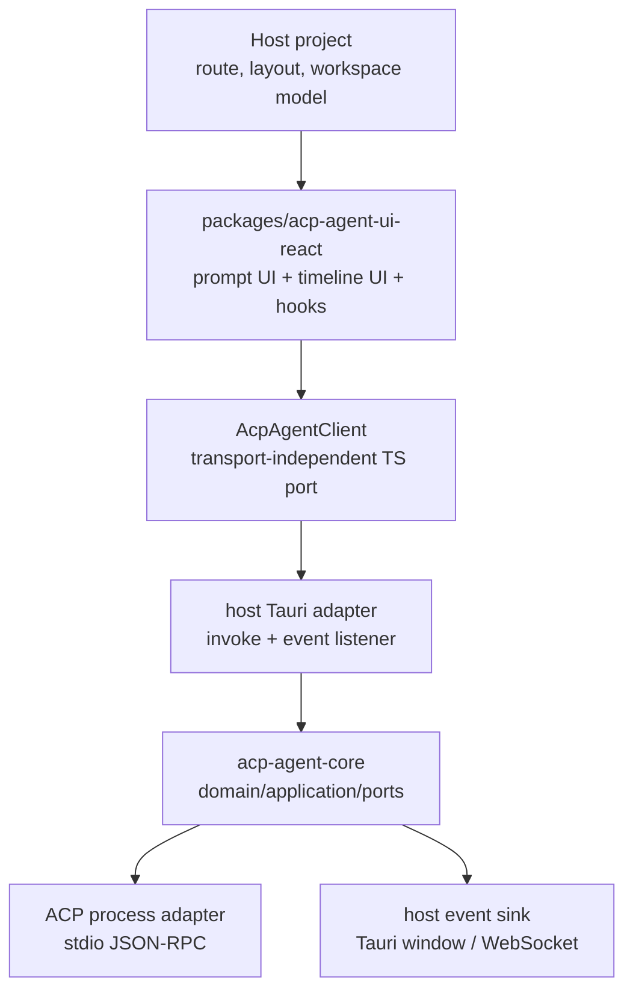
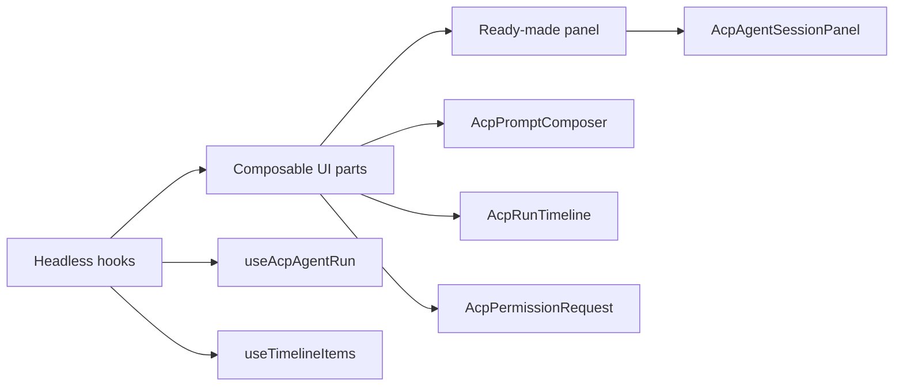
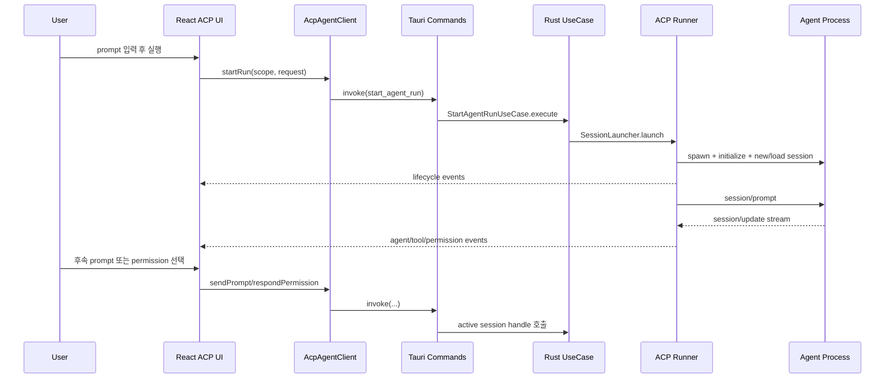

# AW ACP Agent UI 모듈화 전략

## 배경

`apps/agentic-workbench`(AW)는 로컬 worktree에서 ACP agent 프로세스를 시작하고, 사용자가 prompt를 입력하며, 실행 중 추가 prompt와 permission 응답을 보내고, agent가 내보내는 stream/event를 timeline UI로 렌더링한다.

다른 프로젝트에서 이 기능을 쓰려면 AW 화면을 통째로 복사하는 방식은 비용이 크다. 현재 구현은 ACP 실행 기능 자체와 AW의 project/worktree/goal/saved prompt/window 정책이 한 화면에 함께 묶여 있기 때문이다. 따라서 재사용 단위는 “AW 앱”이 아니라 “ACP agent session runtime + prompt composer + event timeline renderer”로 정의해야 한다.

## 목표

- ACP 프로세스 생성, 세션 생성/재개, prompt 전송, 취소, permission 응답을 재사용 가능한 API로 분리한다.
- 프롬프트 입력 UI와 결과 렌더링 UI를 host 프로젝트가 화면 안에 조립할 수 있는 React 컴포넌트로 제공한다.
- Tauri `invoke`, window event, JSON 저장소, AW project/worktree 모델 같은 앱 전용 세부사항을 adapter 뒤로 숨긴다.
- AW는 새 모듈의 첫 번째 host로 남겨 현재 UX를 유지한다.
- 다른 Tauri/React 프로젝트는 최소한의 client adapter와 scope만 제공해 같은 ACP agent UI를 사용할 수 있게 한다.

## 비목표

- 모든 AW 기능을 공용 패키지로 옮기지 않는다.
- project CRUD, Git worktree 생성/삭제, diff review, goal 자동 continuation, saved prompt 관리 전체를 필수 모듈로 만들지 않는다.
- 모든 ACP provider를 범용 SDK 수준으로 추상화하지 않는다.
- Tauri가 아닌 환경을 1차 대상으로 삼지 않는다. 단, 프론트 client port는 WebSocket/HTTP adapter를 나중에 붙일 수 있게 둔다.

## 현재 구현 출발점

- 프론트 타입과 Tauri API wrapper: `apps/agentic-workbench/src/entities/agent-run/model/types.ts`, `apps/agentic-workbench/src/entities/agent-run/api/agent-run-repository.ts`
- 프론트 timeline 변환: `apps/agentic-workbench/src/entities/agent-run/model/format.ts`
- 프롬프트/세션 UI: `apps/agentic-workbench/src/features/agent-run/ui/agent-run-panel.tsx`
- prompt queue/steer helper: `apps/agentic-workbench/src/features/agent-run/model/run-panel-state.ts`
- Rust run domain/event: `apps/agentic-workbench/src-tauri/src/domain/run.rs`, `apps/agentic-workbench/src-tauri/src/domain/events.rs`, `apps/agentic-workbench/src-tauri/src/domain/acp_session.rs`
- Rust use case: `apps/agentic-workbench/src-tauri/src/application/start_agent_run.rs`, `send_prompt.rs`, `cancel_agent_run.rs`, `set_permission_mode.rs`, `list_provider_sessions.rs`
- Rust ports(trait): `apps/agentic-workbench/src-tauri/src/ports/*` (`session_launcher.rs`, `session_handle.rs`, `session_registry.rs`, `event_sink.rs`, `agent_catalog.rs`, `permission.rs`, `acp_session_store.rs`, `provider_session_repository.rs`)
- Rust ACP adapter: `apps/agentic-workbench/src-tauri/src/infrastructure/acp/*`
- Rust event bridge: `apps/agentic-workbench/src-tauri/src/infrastructure/tauri_run_event_sink.rs`
- Rust inbound(Tauri 명령): `apps/agentic-workbench/src-tauri/src/inbound/tauri_commands.rs` (ACP 명령 5개 + project/git/goal/worktree/saved_prompt 명령이 한 파일에 공존, `normalize_run_request`도 여기 위치)

## 문제 구조

현재 `AgentRunPanel`은 다음 책임을 동시에 가진다.

- agent 목록, provider session, run settings 조회
- 새 ACP run 시작과 기존 session 재개
- prompt 입력, queue, steer, Ralph loop 설정
- run event 구독과 local timeline 상태 갱신
- permission request 응답
- goal 조회/수정/진행 기록
- saved prompt toolbar 연동
- AW 화면 레이아웃과 shadcn/ui 조립

이 상태에서는 다른 프로젝트가 필요한 부분만 가져가기 어렵다. 특히 “ACP 프로세스를 만들고 prompt를 주고받는 기능”을 쓰고 싶은 host도 AW의 goal, saved prompt, worktree session UI까지 함께 받아들이게 된다.

## 목표 아키텍처



핵심 원칙은 “React UI는 `AcpAgentClient`만 알고, Rust application은 `SessionLauncher`, `SessionHandle`, `RunEventSink`, `SessionRegistry` 같은 port만 안다”이다. Host 앱은 이 port의 adapter를 제공한다.

## 패키지 분리 전략

### 1. `packages/acp-agent-contract`

TypeScript 공용 계약 패키지다. 다른 프로젝트가 UI 없이도 타입과 client interface를 사용할 수 있게 한다.

포함 항목:

- `AgentDescriptor`, `AgentRunRequest`, `AgentRun`, `ProviderSession`
- `PermissionMode`, `ContextSizePreset`, `ResumePolicy`
- `RunEvent`, `RunEventEnvelope`, `LifecycleStatus`, `PermissionOption`
- `TimelineItem`, `EventGroup`
- `AcpAgentClient`

> **wire 이벤트와 display 이벤트를 구분한다.** 현재 프론트 `RunEvent` union(`types.ts:154`)에는 Rust가 절대 emit하지 않는 `userMessage` variant가 들어 있다. 이것은 prompt 전송 시 프론트가 낙관적으로 timeline에 끼워 넣는 echo(`agent-run-panel.tsx:794`, `582`, `1013`)일 뿐이다. `RunEvent`를 그대로 wire 계약으로 올리면 Rust 발신 이벤트 합집합과 FE 표시 전용 합집합이 섞여, 두 번째 host가 echo 로직을 직접 복제해야 한다. 따라서 계약은 두 층으로 나눈다.
>
> - `RunEvent` — Rust `domain/events.rs`의 enum을 그대로 반영하는 wire 이벤트(`userMessage` 없음)
> - `TimelineEvent`(또는 `TimelineRunEvent`) — `RunEvent`에 FE 전용 `userMessage`를 더한 표시용 union. 낙관적 echo가 어디서 생성되는지(host 측)도 함께 명시한다.
>
> 또한 `RunEvent`의 `usage` variant는 timeline에 들어가지 않고 usage indicator로 별도 소비된다(`TimelineRunEvent`에서 제외). 계약은 `RunEvent`와 `TimelineRunEvent`를 모두 export하고 이 비대칭을 문서화한다. wire 타입은 Rust serde 표현이 정본이므로, **TS↔Rust 정합을 codegen 또는 parity 테스트로 강제**한다(현재는 동기화 장치가 없다).
>
> `AgentRunRequest`는 contract 타입이지만 AW 어휘가 섞여 있다(`goal`은 실제로는 run의 초기 prompt이고, Rust `domain/run.rs:69-70`의 `workspace_id`/`checkout_id`는 항상 null 처리됨). 계약으로 옮길 때는 파일 이동이 아니라 **필드 수준 정리**가 필요하다(`goal` → prompt 의미로 정규화, host 식별자는 `AcpAgentScope.hostRef`로 일원화).

예상 public API:

```ts
export type AcpAgentScope = {
  kind: "localDirectory";
  workingDirectory: string;
  label?: string;
  hostRef?: string;
};

export type AcpAgentClient = {
  listAgents(): Promise<AgentDescriptor[]>;
  listProviderSessions(input: {
    agentId: string;
    scope: AcpAgentScope;
  }): Promise<ProviderSession[]>;
  startRun(input: AgentRunRequest & { scope: AcpAgentScope }): Promise<AgentRun>;
  sendPrompt(input: { runId: string; prompt: string }): Promise<void>;
  cancelRun(runId: string): Promise<void>;
  setPermissionMode(input: {
    runId: string;
    permissionMode: PermissionMode;
  }): Promise<void>;
  respondPermission(input: {
    runId: string;
    permissionId: string;
    optionId: string;
  }): Promise<void>;
  listenRunEvents(callback: (event: RunEventEnvelope) => void): () => void;
};
```

AW의 `workingDirectory` 직접 입력은 `AcpAgentScope`로 감싼다. 이렇게 하면 다른 프로젝트가 project id, container id, task id 같은 host 식별자를 `hostRef` 또는 확장 타입으로 붙일 수 있다.

이 interface는 기존 `agent-run-repository.ts`를 1:1로 옮긴 것이 아니라 **의도적인 변환**이며, 다음을 명시적으로 정리해야 한다.

- **`scope.workingDirectory`와 `AgentRunRequest.cwd`의 중복.** 현재 repository는 `listProviderSessions(agentId, cwd?)`처럼 `cwd`를 positional·optional로 받고(`agent-run-repository.ts:17`, 호출 `agent-run-panel.tsx:374`), `startRun`도 `cwd`를 그대로 보낸다(`agent-run-panel.tsx:813`). scope를 도입하면 working directory가 `scope`와 `request` 양쪽에 생긴다. **둘 중 하나를 정본으로 정하고**(권장: `scope`가 정본, `request.cwd`는 adapter가 scope에서 파생) optional 케이스(작업 디렉터리 없는 세션 나열)를 보존한다.
- **`runId` 소유권.** 현재 client가 `runId`를 생성해 보내고(`agent-run-panel.tsx:791`), 이벤트 필터링(`:513`)과 낙관적 timeline의 키로 쓴다. Rust는 전달된 id를 그대로 존중한다(`tauri_commands.rs:466-467`). 계약에서 `runId`는 **client 생성이며 이벤트 상관(correlation)의 load-bearing 키**임을 명시한다(서버가 부여하도록 바꾸면 기존 필터링 모델이 깨진다).

### 2. `packages/acp-agent-ui-react`

React UI와 headless hook 패키지다. `@tauri-apps/api`를 직접 import하지 않는다.

포함 항목:

- `AcpAgentProvider`: client와 기본 scope를 주입
- `useAcpAgentRun`: run 시작/취소/추가 prompt/permission 응답 상태 머신
- `useAcpRunEvents`: event 구독과 run id 필터링
- `useTimelineItems`: `RunEvent`를 `TimelineItem`으로 변환하고 tool/lifecycle event를 merge
- `AcpPromptComposer`: prompt 입력, 전송, queue, 실행/중단 버튼
- `AcpRunTimeline`: message, thought, plan, tool, terminal, permission, lifecycle, error 렌더링
- `AcpPermissionRequest`: permission 선택 UI
- `AcpAgentSessionPanel`: composer + timeline + 기본 agent/session controls 조립 컴포넌트

포함하지 않을 항목:

- AW goal panel
- AW saved prompt repository
- AW worktree changes/diff panel
- AW route/window 생성 정책
- Tauri command 이름

컴포넌트는 세 단계로 제공한다.



이 구조면 host 프로젝트는 빠르게 붙일 때 `AcpAgentSessionPanel`을 쓰고, 자체 디자인이 필요하면 hook과 parts만 가져갈 수 있다.

### 3. `packages/acp-agent-tauri`

Tauri v2 전용 TypeScript adapter 패키지다.

포함 항목:

- `createTauriAcpAgentClient(options)`
- Tauri command 이름 mapping
- `agent-run-event` listen
- 현재 AW의 DOM fallback event 처리

예상 API:

```ts
export function createTauriAcpAgentClient(options?: {
  eventName?: string;
  commandNames?: Partial<TauriAcpCommandNames>;
}): AcpAgentClient;
```

다른 프로젝트가 command 이름을 다르게 등록해도 `commandNames`만 바꾸면 같은 React UI를 사용할 수 있게 한다.

### 4. Rust core crate 후보

Rust 쪽은 단기적으로 AW `src-tauri/src` 내부 모듈을 정리하고, 장기적으로 workspace crate로 분리한다.

단기 위치:

- `apps/agentic-workbench/src-tauri/src/acp_agent_core`

장기 위치:

- `crates/acp-agent-core`
- `crates/acp-agent-tauri`

`acp-agent-core` 포함 항목:

- `domain/run.rs`, `domain/events.rs`, `domain/agent.rs`, `domain/provider_session.rs`, `domain/acp_session.rs`
- `application/start_agent_run.rs`, `send_prompt.rs`, `cancel_agent_run.rs`, `set_permission_mode.rs`, `list_provider_sessions.rs`
- `ports/session_launcher.rs`, `session_handle.rs`, `session_registry.rs`, `event_sink.rs`, `agent_catalog.rs`, `permission.rs`, `acp_session_store.rs`, `provider_session_repository.rs`
- Ralph loop 안전 상한 **규칙**(`RalphLoopRequest::sanitized`, `domain/run.rs`)과 Ralph 실행 루프(ACP runner). request normalization은 **규칙(core)** 과 **진입 배선(`normalize_run_request`, host 명령 adapter)** 으로 나뉜다 — 후자는 core가 아닌 host에 남는다.

> **`domain/acp_session.rs`는 빠뜨리면 안 된다.** `acp_session_store` port와 ACP runner가 이 타입에 의존하므로, 위 목록에서 누락하면 core 모듈/crate가 컴파일되지 않는다. `acp_session.rs`는 `serde`/`std`/`anyhow` + `domain::run`만 의존해 host 독립적이므로 core에 속한다.
>
> **`listProviderSessions`는 contract가 노출하는 기능이므로 core에 둔다.** provider-session 열거는 세션 재개 selector를 채우는 데이터원이라 "session 재개" 목표(목표 절)에 필수다. 따라서 `ListProviderSessionsUseCase`와 `provider_session_repository` port를 core에 포함한다(반대로 host에 남길 거라면 그 이유를 명시해야 한다 — 계약이 노출하는 한 core가 일관적이다).
>
> **`AgentRunRequest`의 host 어휘 정리.** `domain/run.rs:69-70`의 `workspace_id`/`checkout_id`는 `normalize_run_request`(`tauri_commands.rs:469-470`)가 항상 `None`으로 비운다. core로 옮길 때는 이 두 dead 필드를 제거하거나 TS 계약의 `AcpAgentScope.hostRef`에 대응하는 중립 host-ref 필드로 대체해, Rust core 타입과 TS 계약의 host 정체성 모델을 일치시킨다.

`acp-agent-tauri` 또는 host adapter 포함 항목:

- `#[tauri::command]` 함수
- `AppHandle`, `State`, window label 처리
- JSON 저장소 경로 결정
- `TauriRunEventSink`
- `AppState`의 window close approval 같은 AW/Tauri shell 정책

## 런타임 흐름



## 프론트 모듈 경계

### Headless state

`AgentRunPanel`의 상태 로직을 먼저 hook으로 떼어낸다.

- `useAgentSelection`: agent 목록, model/context option, provider session 선택
- `useAcpRunController`: active run id, running/awaiting/cancelling 상태, start/cancel/send/steer
- `usePromptQueue`: queue 삽입/수정/삭제/순서 변경
- `useRunTimeline`: event listen, `TimelineItem` merge, filter
- `usePermissionResponse`: pending permission 추출과 응답 mutation

이 단계에서 UI 변경은 최소화한다. 기존 `AgentRunPanel`은 새 hook을 호출하는 wrapper로 바뀐다.

### Presentation components

다음 컴포넌트는 host 앱에서도 그대로 쓸 수 있게 props 중심으로 만든다.

- `AgentSelector`
- `ProviderSessionSelector`
- `RunSettingsButton`
- `PromptComposer`
- `QueuedPromptList`
- `RunTimeline`
- `TimelineEventItem`
- `PermissionCard`
- `UsageIndicator`

AW 전용 `GoalStatusPanel`, `SavedPromptToolbar`, `WorktreeChangesPanel`은 optional slot으로 연결한다.

```tsx
<AcpAgentSessionPanel
  scope={{ kind: "localDirectory", workingDirectory }}
  client={client}
  headerSlot={<WorktreeHeader />}
  composerLeftSlot={<SavedPromptToolbar onSelect={sendSavedPrompt} />}
  sideSlot={<WorktreeChangesPanel />}
/>
```

## 백엔드 모듈 경계

현재 Rust는 이미 hexagonal architecture에 가깝다. 모듈화 시 우선순위는 “좋은 port를 유지하면서 Tauri 조립 코드를 얇게 만들기”다.

공용 core로 옮길 것:

- `AgentRunRequest`(host 어휘 제거 후), `RunEvent`, `AcpSession`, `PermissionMode`, `ContextSizePreset`
- `StartAgentRunUseCase`, `SendPromptUseCase`, `CancelAgentRunUseCase`, `SetPermissionModeUseCase`, `ListProviderSessionsUseCase`
- `SessionLauncher`, `SessionHandle`, `RunEventSink`, `SessionRegistry`, `ProviderSessionRepository`
- ACP stdio JSON-RPC runner와 session update mapper

> 네 run use case는 이미 domain 타입·core port·application 에러 enum만 의존하고 AW repository/`window_manager`/`AppState`를 끌어오지 않는다(`AppState`·`TauriRunEventSink`는 generic `SessionRegistry`/`RunEventSink` 파라미터로 명령층 `inbound/tauri_commands.rs:485-497`에서 주입). 따라서 run-path core 추출은 사실상 파일 이동 수준이다 — 이 전략의 load-bearing 가정이며 코드상 성립한다.

host adapter로 남길 것:

- `inbound/tauri_commands.rs`의 ACP 명령 5개(`start_agent_run`, `send_prompt_to_run`, `set_run_permission_mode`, `cancel_agent_run`, `respond_agent_permission`) → `acp-agent-tauri` adapter로 분리. 나머지 project/git/goal/worktree/saved_prompt 명령은 AW 전용으로 남는다.
- `normalize_run_request` 같은 host 배선 코드
- `TauriRunEventSink`
- `window_manager`
- AW project/worktree repository 조립
- JSON 저장소의 실제 위치
- `ACP_WORKBENCH_MAX_RUNS` 같은 앱 환경 변수 이름

> `tauri_commands.rs`는 단순히 "줄이는" 것이 아니라 **분리(split)** 한다. 이 파일은 664줄이고 ACP 명령은 5개뿐이며 나머지 대부분이 무관한 AW 명령이므로, ACP만 빼내도 파일 자체는 작아지지 않는다. ACP 5개 명령은 이미 각 15~25줄의 얇은 use case 조립이다.

장기적으로 ACP runner까지 core에 둘지 별도 `acp-agent-protocol` crate로 둘지는 분리 후 결정한다. 지금 단계에서는 runner가 실제 재사용 가치가 높으므로 core 후보에 포함한다.

## 단계별 실행 계획

### 1단계: 계약 타입과 client port 만들기

- `packages/acp-agent-contract`를 추가한다.
- `entities/agent-run/model/types.ts`를 **타입 수준으로 분리**한다(파일 통째 이동이 아니다). goal/worktree/settings 타입은 AW에 남기고 ACP 타입만 옮기며, `AgentRunRequest.goal`은 prompt 의미로 정규화한다.
- `AcpAgentClient` interface를 정의한다. `AcpAgentScope`는 단순 래퍼가 아니라 param 재구성이 필요하다 — `cwd`(optional)를 `scope.workingDirectory`로 매핑하고 `runId`가 client 생성·이벤트 상관 키임을 유지한다. `agent-run-repository.ts`는 이미 클래스 상태 없는 얇은 `invoke` shim(9개 async 함수 + 1개 DOM listener)이라 wrapping 자체는 기계적이다.
- AW `agent-run-repository.ts`는 `createTauriAcpAgentClient` 형태의 adapter로 감싼다.
- 기존 import는 임시 re-export로 유지해 큰 변경을 피한다.

검증:

- `pnpm --filter @yoophi/agentic-workbench check-types`
- `entities/agent-run/model/format.test.ts`

### 2단계: timeline 변환 로직 분리

- `toTimelineItem`, `appendOneTimelineItem`, `eventGroups`를 `packages/acp-agent-contract`로 옮긴다. `format.ts`는 React 의존이 0이고 순수하므로 ui-react보다 contract가 적합하다(`format.test.ts`도 함께 이동, `markdown-annotation-core` 관례와 동일).
- tool update merge, lifecycle merge, agent/thought text merge 테스트를 공용 패키지로 이동한다.
- `RunTimeline`을 `TimelineItem[]`만 받는 pure component로 만든다.
- `usage` 이벤트는 timeline에서 제외되고 usage indicator로 별도 소비된다는 비대칭(`TimelineRunEvent`)을 변환 경계에 보존한다.

검증:

- timeline unit test (synthetic 시퀀스에 **FE 전용 `userMessage` + Rust 발신 이벤트**를 함께 넣어 merge 로직을 검증한다)
- Storybook organisms story 신규 작성 — synthetic event sequence는 새로 추가해야 한다(기존 organisms story는 mocked Tauri 명령 기반이라 그대로 재사용되지 않는다)

### 3단계: prompt composer와 queue 로직 분리

- `run-panel-state.ts`(순수 helper)를 가장 먼저, 안전하게 공용 패키지로 옮긴다.
- `PromptComposer`가 `value`, `disabled`, `isRunning`, `canSend`, `canCancel`, `onSend`, `onCancel`만 받도록 만든다.
- queued prompt list와 edit dialog를 분리한다.
- Ralph loop는 optional prop으로 둔다.
- **hook 간 ref/effect 결합을 명시적으로 설계한다.** run controller·timeline·queue·permission이 mutable ref와 실행 순서 가정을 공유하므로 독립적으로 떼낼 수 없다. `useAcpRunController`가 run lifecycle ref를 소유해 `useRunTimeline`/`usePermissionResponse`에 노출하고, pending permission은 별도 채널이 아니라 timeline items에서 파생되도록 한다. ("wrapper로 바뀐다"는 단순 치환이 아니라 co-design이 필요하다.)

검증:

- queue reorder/edit/remove unit test
- hook 상태머신(`useAcpAgentRun`) 단위 테스트(RTL/vitest) — 순수 hook이므로 Storybook보다 우선한다
- Storybook molecules story 신규 작성으로 idle/running/awaiting 상태 확인(prop 기반 fixture로 새로 작성)

### 4단계: `AcpAgentSessionPanel` 조립

- agent/session selector, composer, timeline을 조립한 ready-made panel을 만든다.
- goal/saved prompt/worktree changes는 slot으로 받는다.
- AW `AgentRunPanel`은 새 panel에 AW slot을 넣는 adapter 컴포넌트가 된다.

검증:

- AW 기존 session 화면 smoke test
- Storybook pages story
- 외부 prompt request가 기존처럼 start 또는 queue 되는지 확인

### 5단계: Rust core 경계 정리

- Rust domain/application/ports를 `acp_agent_core` 모듈 아래로 모은다. **`domain/acp_session.rs`와 `provider_session_repository` port, `list_provider_sessions` use case를 빠뜨리지 않는다**(누락 시 컴파일 실패 또는 contract 미충족).
- `inbound/tauri_commands.rs`에서 ACP 명령 5개를 `acp-agent-tauri` adapter로 **분리**한다. 나머지 AW 명령은 AW 명령 모듈에 남긴다(파일을 "줄이는" 게 아니라 쪼갠다).
- `TauriRunEventSink`와 `AppState`는 adapter로 남긴다. 이때 `TauriRunEventSink::with_target`의 미사용 `_state: AppState` 파라미터를 제거해 adapter 시그니처가 실제 의존(App만)을 반영하게 한다.
- `AcpAgentRunner`가 `SessionLauncher` 구현체로 유지되는지 테스트한다.

검증:

- `cargo test` in `apps/agentic-workbench/src-tauri`
- start/send/cancel/set permission/list provider sessions use case test
- ACP session update mapper test

### 6단계: 외부 프로젝트 통합 샘플

- `examples/acp-agent-panel-host`(실행형 host) 또는 문서 예제를 만든다. **실행형을 택하면** 현재 `examples/`는 `pnpm-workspace.yaml` 멤버가 아니고 md fixture만 있으므로, `examples/*`를 workspace glob에 등록(또는 `apps/` 아래 배치)하고 vite/tauri 셸을 새로 스캐폴딩해야 한다 — 이 비용을 계획에 포함한다. 문서 예제만이라면 이 비용은 없다.
- host가 제공해야 하는 것은 `AcpAgentClient`, `AcpAgentScope`, container layout뿐임을 보여준다. 단, `startRun`은 `AgentRunRequest & { scope }`이므로 host는 여전히 agent/model/context/resume/ralph 등 전체 request 필드를 채워야 한다 — `scope`는 host 식별자(working directory + hostRef) 역할이다.
- Tauri command 이름이 다른 경우 `createTauriAcpAgentClient({ commandNames })`로 mapping하는 예제를 포함한다.

## 마이그레이션 리스크와 대응

- 이벤트 유실: 현재 `listenRunEvents`는 DOM fallback만 구독한다(`agent-run-repository.ts:55-72`). 한편 Rust sink는 활성 세션 경로에서 Tauri 채널(`window.emit`)과 DOM CustomEvent를 **둘 다** emit한다(`tauri_run_event_sink.rs:43-45`) — 즉 Tauri emit은 이미 존재하나 FE가 미구독 상태다. 공용 adapter는 `listen('agent-run-event')`를 primary로, DOM을 fallback으로 함께 처리하고, **두 채널이 동시에 오면 dedup**하며 unsubscribe를 보장한다.
- 디자인 시스템 결합: `agent-run`이 쓰는 것은 `@yoophi/ui`가 아니라 **AW 자체 vendored shadcn(`src/components/ui`, 14개 모듈)** 이다. 따라서 "AW와 같은 monorepo UI 사용"은 부정확하며, 패널 추출은 (a) AW의 local shadcn 사본에 의존하거나 (b) `@yoophi/ui`로 먼저 통합하거나 (c) 필요한 primitive를 ui-react로 vendor하는, 가격이 매겨지지 않은 포팅 비용을 수반한다. 전략을 하나 택해 명시한다. 또한 `className`+slot으로는 **react-query 결합(쿼리는 prop이 아니다)과 `RunEventItem`에 박힌 markdown 렌더러를 풀 수 없다** — 이들은 hook으로 들어올려야 한다.
- 패키지 의존성 증가: peer dependency 목록은 실제 결합을 반영해야 한다 — `react-markdown`, `remark-gfm`, `lucide-react`, **`@tanstack/react-query`**, `react-resizable-panels`. (`react-resizable-panels`는 현재 `@yoophi/ui`를 통해 들어오므로 출처를 정리한다.)
- 패키지 배포/버전 부재: 현재 모든 워크스페이스 패키지가 `private: true`이고 `@yoophi/ui`는 **build script 없이 raw `src`를 export**한다(repo 전반 동일 패턴). 따라서 "다른 프로젝트" 소비는 monorepo 내부 host로 한정된다. out-of-repo 소비는 **범위 외로 명시하거나 build/publish 계획을 추가**한다.
- 테스트 게이트 부재: hook 상태머신(`useAcpAgentRun`) 테스트와 **TS↔Rust 이벤트 wire 정합(parity) 게이트**가 없다. contract에 codegen 또는 parity 테스트를 도입한다(현재 동기화 장치 없음).
- 추출 규모/start 경로 얽힘: `agent-run-panel.tsx`는 **2787줄**이며, goal-continuation auto-start effect가 `startRun`을 호출(`:636`)하고 session-reuse 준비 상태(`sessionReady`)에 gate된다. core controller는 `start`를 순수 API로 노출하고, goal-continuation(core 비목표)은 AW가 host 측 caller(slot/effect)로 유지해야 한다 — 1단계는 저위험이지만 3~4단계에 이 untangling 비용이 숨어 있다.
- 기능 과잉: goal/saved prompt/worktree changes는 core panel의 필수 기능으로 넣지 않는다.
- Rust crate 분리 비용: 처음부터 crate로 떼지 말고 AW 내부 모듈 경계를 먼저 만든 뒤, import 경로만 옮길 수 있을 때 workspace crate로 승격한다.

## 완료 기준

- 다른 React/Tauri 프로젝트가 AW route와 project 모델 없이 `AcpAgentSessionPanel`을 렌더링할 수 있다.
- host는 `AcpAgentClient`(transport adapter)와 `AcpAgentScope`(host 식별자)를 제공하면 AW route·project 모델 없이 새 run 시작, prompt 전송, 취소, permission 응답, timeline 렌더링을 사용할 수 있다. (`scope`가 AW의 project 결합을 대체한다는 의미이며, `startRun`에는 여전히 전체 `AgentRunRequest` 필드를 전달한다.)
- AW 기존 화면은 같은 기능을 유지하되 goal/saved prompt/worktree UI는 slot 또는 wrapper로 붙는다.
- Rust Tauri command는 앱 adapter로 남고, run use case와 ACP session runtime은 host 독립 모듈로 테스트된다.
