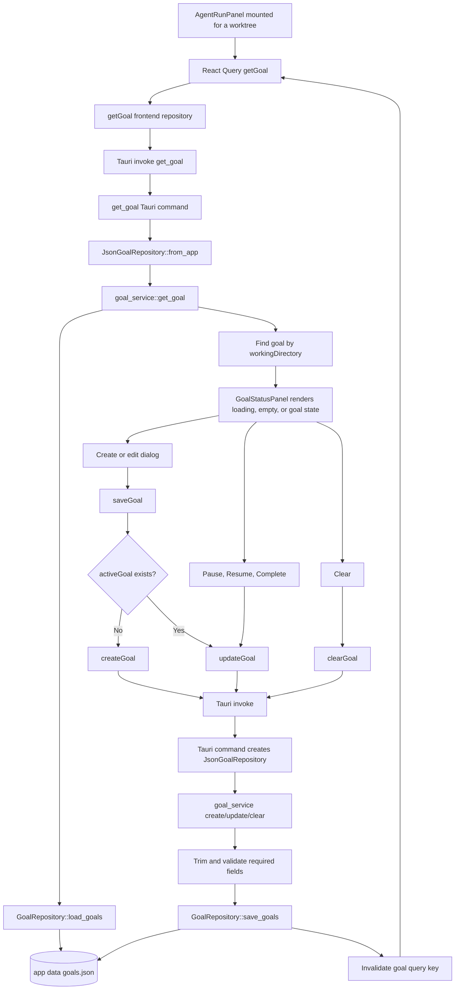

# Goal Feature Implementation

This document describes how the goal feature is implemented on `origin/main` as
of commit `c2eb75b`.

The feature stores one long-running goal per worktree. It is shown inside the
agent run panel, but it is not currently wired into the agent run request
automatically. A separate `AgentRunRequest.goal` field still carries the prompt
that starts a specific agent run.

## High-Level Flow



## Frontend Model And API

The frontend model is defined in
`apps/desktop/src/entities/agent-run/model/types.ts`.

`GoalStatus` supports these values:

- `active`
- `paused`
- `blocked`
- `usageLimited`
- `budgetLimited`
- `complete`

`ThreadGoal` stores:

- `workingDirectory`
- `objective`
- `status`
- `tokenBudget`
- `tokensUsed`
- `timeUsedSeconds`
- `createdAt`
- `updatedAt`

The frontend API adapter is
`apps/desktop/src/entities/agent-run/api/goal-repository.ts`. It maps the UI to
four Tauri commands:

- `get_goal`
- `create_goal`
- `update_goal`
- `clear_goal`

React Query keys are centralized in
`apps/desktop/src/entities/agent-run/api/query-keys.ts`. The goal cache key is
`["goal", workingDirectory]`, so each worktree has an independent cached goal.

## Agent Run Panel Integration

The goal UI is implemented in
`apps/desktop/src/features/agent-run/ui/agent-run-panel.tsx`.

On mount, `AgentRunPanel` calls `getGoal(workingDirectory)` through React Query.
The returned goal is rendered by `GoalStatusPanel`.

`GoalStatusPanel` has three display states:

- loading: shows a spinner and loading text
- empty: shows that no goal exists for the worktree and offers `Goal 생성`
- populated: shows the objective, status badge, optional token budget, and
  action buttons

The available actions are:

- Create: opens the goal dialog with empty fields.
- Edit: opens the goal dialog with the current objective and token budget.
- Pause: updates status to `paused` when the current status is `active`.
- Resume: updates status to `active` when current status is `paused` or
  `blocked`.
- Complete: updates status to `complete` unless it is already complete.
- Clear: removes the worktree goal.

After create, update, or clear, the mutation invalidates the worktree's goal
query key so the panel reloads the latest persisted value.

When editing a completed goal, saving a new objective also sends
`status: active`. This reactivates completed goals when the user revises them.

## Tauri Command Boundary

The commands are registered in `apps/desktop/src-tauri/src/lib.rs` and
implemented in `apps/desktop/src-tauri/src/inbound/tauri_commands.rs`.

The inbound layer defines:

- `GoalInput`: `workingDirectory`, `objective`, `tokenBudget`
- `GoalUpdateInput`: optional `objective`, optional `status`, optional
  `tokenBudget`

`GoalUpdateInput.token_budget` is an `Option<Option<usize>>`. This allows the
command layer to distinguish between:

- field omitted: do not change the current budget
- `null`: clear the current budget
- number: replace the budget

Each command constructs a `JsonGoalRepository` from the Tauri app handle and
delegates business behavior to `goal_service`.

## Domain And Application Service

The backend domain types live in
`apps/desktop/src-tauri/src/domain/goal.rs`.

The repository port is
`apps/desktop/src-tauri/src/domain/goal_repository.rs`:

- `load_goals() -> Vec<ThreadGoal>`
- `save_goals(goals)`

The application service is
`apps/desktop/src-tauri/src/application/goal_service.rs`.

It owns the business rules:

- `get_goal` trims and validates the worktree path, then finds a matching goal.
- `create_goal` trims required fields, creates an `active` goal, initializes
  usage counters to zero, and replaces any existing goal for the same worktree.
- `update_goal` requires an existing goal and updates only the provided fields.
- `clear_goal` requires an existing goal and removes it.

Both `working_directory` and `objective` are trimmed and must be non-empty.
`created_at` and `updated_at` use RFC 3339 timestamps from `Utc::now()`.

## Persistence

The outbound adapter is
`apps/desktop/src-tauri/src/infrastructure/json_goal_repository.rs`.

It stores goals in the Tauri app data directory as:

```text
goals.json
```

The file contains a pretty-printed JSON array of `ThreadGoal` records. If the
file does not exist, `load_goals` returns an empty list. Before the repository is
created, the app data directory is created if needed.

The current implementation performs whole-file read and whole-file write for
each operation.

## Relationship To Agent Runs

The persisted `ThreadGoal` is worktree metadata. It is not automatically copied
into `AgentRunRequest.goal` when a run starts.

The agent run prompt still comes from the prompt input and is passed through
`startRun(goal: string)` into `startAgentRun({ goal, ... })`.

This means the user can use the stored goal as context while deciding what to
run, but the code does not currently enforce goal execution, update token usage,
track elapsed time, or mark goals complete based on agent output.

## Test Coverage

`apps/desktop/src-tauri/src/application/goal_service.rs` includes focused unit
tests for:

- creating a goal and replacing an existing goal for the same worktree
- updating user-managed fields
- clearing a worktree goal
