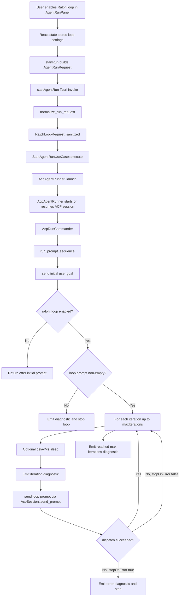

# Ralph Mode Implementation

This document describes how Ralph mode is implemented on `origin/main` as of
commit `c2eb75b`.

In the current codebase, the user-facing feature is named **Ralph loop** rather
than Ralph mode. It lets an agent run start with the user's direct prompt and
then automatically send the same follow-up loop prompt for a bounded number of
iterations.

## High-Level Flow

## Frontend Implementation

The frontend model defines `RalphLoopRequest` in
`apps/desktop/src/entities/agent-run/model/types.ts`. The payload is serialized
in camelCase and includes:

- `enabled`
- `maxIterations`
- `promptTemplate`
- `stopOnError`
- `stopOnPermission`
- `delayMs`

The UI lives in `apps/desktop/src/features/agent-run/ui/agent-run-panel.tsx`.
The panel keeps Ralph loop settings in local React state:

- `ralphLoopEnabled`, default `false`
- `ralphMaxIterations`, default `5`
- `ralphDelaySeconds`, default `0`
- `ralphStopOnError`, default `true`
- `ralphPromptTemplate`, default Korean follow-up instruction

When `startRun` builds the `AgentRunRequest`, it includes `ralphLoop` only when
the user has enabled Ralph loop. The frontend converts seconds to milliseconds
and currently sends `stopOnPermission: false`.

While a run is active, the Ralph loop controls are disabled. That means the loop
settings are fixed at run start and are not edited live.

## Backend Request Normalization

The Tauri command layer receives the request in
`apps/desktop/src-tauri/src/inbound/tauri_commands.rs`.

Before execution, `normalize_run_request`:

- guarantees a `run_id`
- clears unsupported `workspace_id` and `checkout_id`
- sanitizes `ralph_loop` with `RalphLoopRequest::sanitized`

The domain model is defined in `apps/desktop/src-tauri/src/domain/run.rs`.
Backend safety limits are:

- `MAX_RALPH_ITERATIONS = 100`
- `MAX_RALPH_DELAY_MS = 60_000`

`RalphLoopRequest::sanitized` trims `prompt_template`, clamps
`max_iterations` into `1..=100`, and caps `delay_ms` at 60 seconds.

## Execution Path

`StartAgentRunUseCase` owns run registry bookkeeping and spawns the run task.
It delegates process/session details to the `SessionLauncher` port.

The ACP implementation is in
`apps/desktop/src-tauri/src/infrastructure/acp/runner.rs`:

1. `AcpAgentRunner::launch` starts or resumes an ACP session.
2. It stores `request.ralph_loop` in `AcpRunCommander`.
3. `AcpRunCommander::run_to_completion` calls `run_prompt_sequence`.
4. `run_prompt_sequence` sends the initial goal first.
5. If Ralph loop is enabled, it repeatedly sends the configured
   `prompt_template`.

Each prompt is dispatched through `AcpSession::send_prompt`, which uses an
`in_flight` mutex. If the previous prompt is still being processed, dispatch
fails with `agent is still responding to the previous prompt`.

## Stop Conditions

Ralph loop stops when one of these conditions is met:

- The initial prompt dispatch fails.
- `ralph_loop` is absent or `enabled` is false.
- The sanitized loop prompt is empty.
- A follow-up prompt dispatch fails and `stopOnError` is true.
- The loop reaches `maxIterations`.

When `stopOnError` is false, prompt dispatch failures emit an error event but
the loop continues to the next iteration.

## Events And User Visibility

The runner emits diagnostic and lifecycle events during the loop:

- `PromptSent` lifecycle when a prompt is submitted.
- `PromptCompleted` lifecycle after the ACP prompt returns, including the ACP
  stop reason.
- diagnostic event when each Ralph loop iteration starts.
- diagnostic event when the loop stops because it reached `maxIterations`.
- error event when prompt dispatch fails.

These events flow through the same run event pipeline as normal agent messages,
so the frontend timeline can render Ralph loop progress without a separate
event channel.

## Current Gaps

`stopOnPermission` is present in the frontend and backend request types, but the
current runner does not branch on it. The frontend always sends
`stopOnPermission: false`.

The loop is bounded by iteration count rather than goal completion detection.
The default prompt asks the agent to stop when the objective is complete, but the
runner itself does not parse completion from the agent response.

Ralph loop settings are only applied at run start. Changing them during an
active run is not currently supported.

## Test Coverage

The backend has focused tests for the core behavior:

- request normalization sanitizes Ralph loop bounds and prompt whitespace
- `run_prompt_sequence` sends the initial prompt plus follow-up prompts until
  `maxIterations`
- dispatch failure stops the loop when `stopOnError` is enabled
