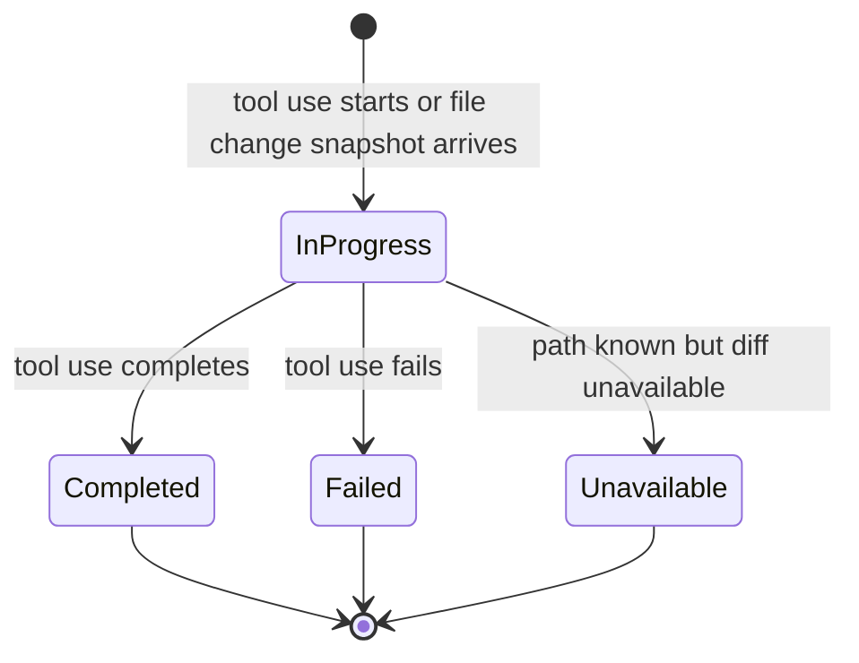

# Data Model: Tool Use File Change Display

## Agent Run

**Purpose**: Visible execution session containing user prompts, agent messages, tool uses, permissions, terminal output, and lifecycle events.

**Key fields**:

- `id`: Unique run identifier.
- `events`: Chronological stream of run events.
- `workingDirectory`: Workspace root associated with the run.

**Relationships**:

- Contains many `Tool Use` events.
- Owns the session/workspace boundary used to validate file paths.

## Tool Use

**Purpose**: Timeline item representing an agent tool call or tool call update.

**Key fields**:

- `toolCallId`: Optional stable provider id used to merge pending/running/completed updates.
- `status`: Tool lifecycle status such as `pending`, `running`, `completed`, or `failed`.
- `title`: User-visible tool label.
- `locations`: Paths reported by the tool/provider.
- `fileChanges`: Zero or more `File Change` entries.

**Relationships**:

- Belongs to one `Agent Run`.
- Owns zero or more `File Change` entries.

**Validation rules**:

- If `toolCallId` exists, updates with the same id merge without losing existing file changes.
- `fileChanges` must remain associated with the producing tool use and must not be merged into unrelated tool items.
- Completion/failure status updates must preserve previously captured file changes unless the update provides a newer version of the same file-change entry.

## File Change

**Purpose**: User-visible summary of one changed file produced by a tool use.

**Key fields**:

- `path`: Workspace-relative path when safely derivable; otherwise a display-safe absolute path that has already passed backend root checks.
- `oldPath`: Previous path for renames, otherwise null.
- `kind`: `added`, `modified`, `deleted`, `renamed`, or `unknown`.
- `status`: `inProgress`, `completed`, `failed`, or `unavailable`.
- `diff`: Unified diff text when available.
- `content`: Full bounded text content for newly written files when a unified diff is not available.
- `binary`: Whether the content is binary or not renderable as text.
- `truncated`: Whether `diff` or `content` was shortened for display limits.
- `message`: Optional fallback or failure explanation.

**Relationships**:

- Belongs to exactly one `Tool Use`.
- May contain many `Diff Hunk` groups when `diff` is available.

**Validation rules**:

- `path` is required.
- At least one of `diff`, `content`, `binary`, or `message` must be present for display.
- `binary = true` means text diff rendering is skipped.
- `truncated = true` must be visible in the UI.
- Missing diff/content must render a fallback message, not an empty block.

## Diff Hunk

**Purpose**: Parsed line-level view of a unified diff.

**Key fields**:

- `header`: Hunk header line when present.
- `oldStart`: Starting line number in the previous file.
- `newStart`: Starting line number in the new file.
- `lines`: Ordered diff lines with old/new line numbers and line kind.

**Relationships**:

- Derived from a `File Change.diff`.

**Validation rules**:

- Hunk parsing is display-only; invalid or partial diff input must not break the timeline.
- Long lines must wrap or scroll inside the diff container without widening the full page.

## State Transitions

