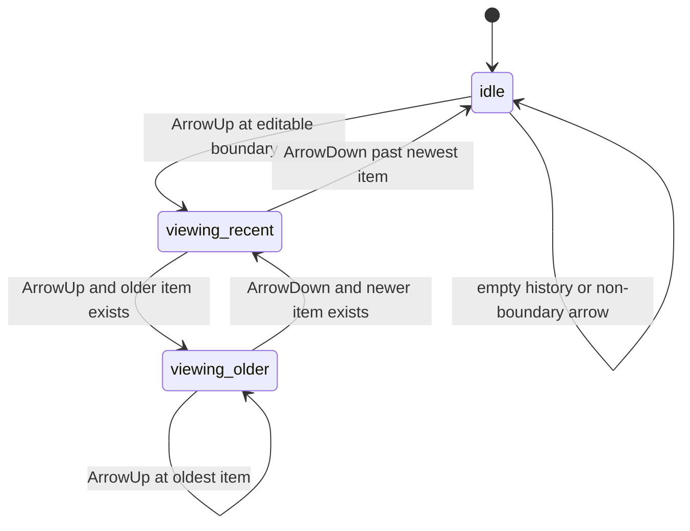

# 데이터 모델: 프롬프트 히스토리 탐색

## Prompt History Entry

사용자가 실제 전송한 prompt 한 건을 나타낸다.

### 필드

- `text`: 전송된 prompt 텍스트. 앞뒤 공백이 제거된 값이다.
- `sequence`: 현재 panel runtime 안에서의 전송 순서. 오래된 항목일수록 작은 순서다.

### 검증 규칙

- `text.trim()`이 빈 문자열이면 항목을 만들지 않는다.
- 같은 `text`가 반복 전송되어도 별도 항목으로 유지한다.
- 항목 순서는 전송 순서를 보존한다.

## Prompt Draft

사용자가 아직 전송하지 않은 현재 입력창 내용을 나타낸다.

### 필드

- `text`: 현재 textarea의 값. 공백과 줄바꿈을 그대로 보존한다.

### 검증 규칙

- draft는 비어 있을 수 있다.
- history 탐색을 시작하는 순간의 draft는 별도로 보존되어야 한다.
- history의 가장 최근 위치를 지나 `ArrowDown`으로 돌아오면 보존된 draft가 복원된다.

## History Cursor

사용자가 현재 history의 어느 위치를 보고 있는지 나타낸다.

### 상태

- `idle`: history 탐색 중이 아니며 textarea 값은 현재 draft다.
- `viewing(index)`: history 항목을 보고 있다. `index`는 history 배열의 위치이며 오래된 항목이 0이다.

### 상태 전이

## Navigation Request

history 탐색 시도 한 번을 나타낸다.

### 필드

- `direction`: `previous` 또는 `next`
- `history`: Prompt History Entry 목록
- `currentInput`: 현재 textarea 값
- `cursor`: 현재 History Cursor
- `preservedDraft`: 탐색 시작 전 보존한 Prompt Draft
- `isEditableBoundary`: 여러 줄 입력에서 history 탐색이 허용되는 커서 경계인지 여부
- `hasModifierKey`: modifier key가 함께 눌렸는지 여부

### 검증 규칙

- `hasModifierKey`가 true이면 탐색하지 않는다.
- `isEditableBoundary`가 false이면 탐색하지 않는다.
- `history`가 비어 있으면 탐색하지 않는다.

## Navigation Result

탐색 시도 결과를 나타낸다.

### 필드

- `handled`: history 탐색으로 처리되었는지 여부
- `nextInput`: textarea에 표시할 다음 값
- `nextCursor`: 다음 History Cursor
- `nextPreservedDraft`: 다음 보존 draft

### 결과 규칙

- `handled`가 false이면 caller는 textarea 기본 동작을 유지한다.
- `ArrowUp`으로 idle에서 첫 탐색을 시작하면 `currentInput`을 preserved draft로 저장한다.
- `ArrowDown`으로 newest history 다음으로 이동하면 preserved draft를 복원하고 cursor는 idle이 된다.
