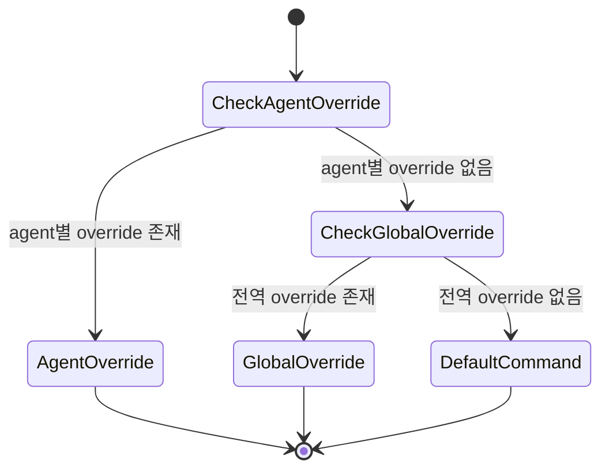

# 데이터 모델: ACP Agent 실행 명령 Override

## AgentRunSettings

작업 디렉터리별 agent 실행 설정 묶음이다. 기존 저장 구조를 유지하면서 override 설정을 선택 필드로 확장한다.

### Fields

- `workingDirectory`: 설정이 적용되는 작업 디렉터리. 필수, 앞뒤 공백 제거 후 빈 값 불가.
- `agentId`: 기본 선택 agent. 선택 값, 앞뒤 공백 제거.
- `permissionMode`: 실행 권한 모드.
- `modelId`: 선택 모델. 빈 값은 provider 기본값으로 정규화.
- `contextSize`: 선택 context size.
- `sessionMode`: 새 세션 또는 기존 세션 재사용 선호.
- `ralphLoop`: Ralph loop 설정.
- `commandOverrides`: ACP agent 실행 명령 override 설정. 없으면 override 없음으로 처리한다.

### Validation Rules

- 기존 저장 파일에 `commandOverrides`가 없어도 정상 로드되어야 한다.
- 저장 시 command override 문자열은 앞뒤 공백을 제거한다.
- 공백 제거 후 빈 문자열은 저장하지 않거나 `null`과 동등한 override 없음으로 처리한다.
- override 변경은 다른 `AgentRunSettings` 필드를 임의로 변경하지 않는다.

## AgentCommandOverrides

전역 override와 agent 종류별 override 목록이다.

### Fields

- `globalCommand`: 모든 agent에 적용할 기본 override. 선택 값.
- `agentCommands`: agent id를 key로 하는 agent 종류별 override map. 선택 값.

### Validation Rules

- `agentCommands` key는 등록된 agent id와 비교 가능한 문자열이어야 하며 앞뒤 공백을 제거한다.
- `agentCommands` value가 비어 있으면 해당 agent override는 제거된 것으로 처리한다.
- 전역 값과 agent별 값이 모두 존재하면 agent별 값이 우선한다.

## CommandResolutionResult

agent 실행 직전에 어떤 명령이 선택되었는지 나타내는 순수 해석 결과다.

### Fields

- `agentId`: 실행 대상 agent id.
- `command`: 선택된 실행 명령 문자열.
- `source`: `agentOverride`, `globalOverride`, `defaultCommand` 중 하나.

### State Transitions

### Validation Rules

- `agentOverride`는 같은 agent id에 저장된 non-empty override가 있을 때만 가능하다.
- `globalOverride`는 agent별 override가 없고 global command가 non-empty일 때만 가능하다.
- `defaultCommand`는 override가 없을 때 agent catalog의 기본 명령을 사용한다.
- 기본 명령도 찾을 수 없으면 실행 시작은 사용자에게 오류를 반환한다.

## SettingsPageState

설정 화면에서 사용자에게 표시되는 편집 상태다.

### Fields

- `isLoading`: 저장된 설정을 불러오는 중인지 여부.
- `loadError`: 설정 로드 실패 메시지.
- `saveError`: 설정 저장 실패 메시지.
- `globalCommandDraft`: 전역 override 입력값.
- `agentCommandDrafts`: agent별 override 입력값 map.
- `effectiveSources`: 각 agent의 현재 적용 출처.

### Validation Rules

- 저장 성공 후 draft 값과 저장된 값이 일치해야 한다.
- 초기화는 대상 override만 제거하고 다른 설정값은 유지해야 한다.
- 로드 실패 시 사용자는 설정 상태를 신뢰할 수 없음을 볼 수 있어야 한다.

## ExecutionFailureNotice

잘못된 override로 agent 실행이 실패했을 때 표시되는 사용자 오류 상태다.

### Fields

- `runId`: 실패한 run id.
- `agentId`: 실행 대상 agent id.
- `message`: 사용자가 이해할 수 있는 실패 메시지.
- `commandSource`: 실패한 명령 출처. 확인 가능한 경우 `agentOverride` 또는 `globalOverride`를 표시한다.

### Validation Rules

- 실패 표시가 기존 세션 목록, worktree 정보, 다른 설정값을 변경하지 않아야 한다.
- 사용자가 설정 화면으로 이동해 override를 수정할 수 있는 경로가 있어야 한다.
