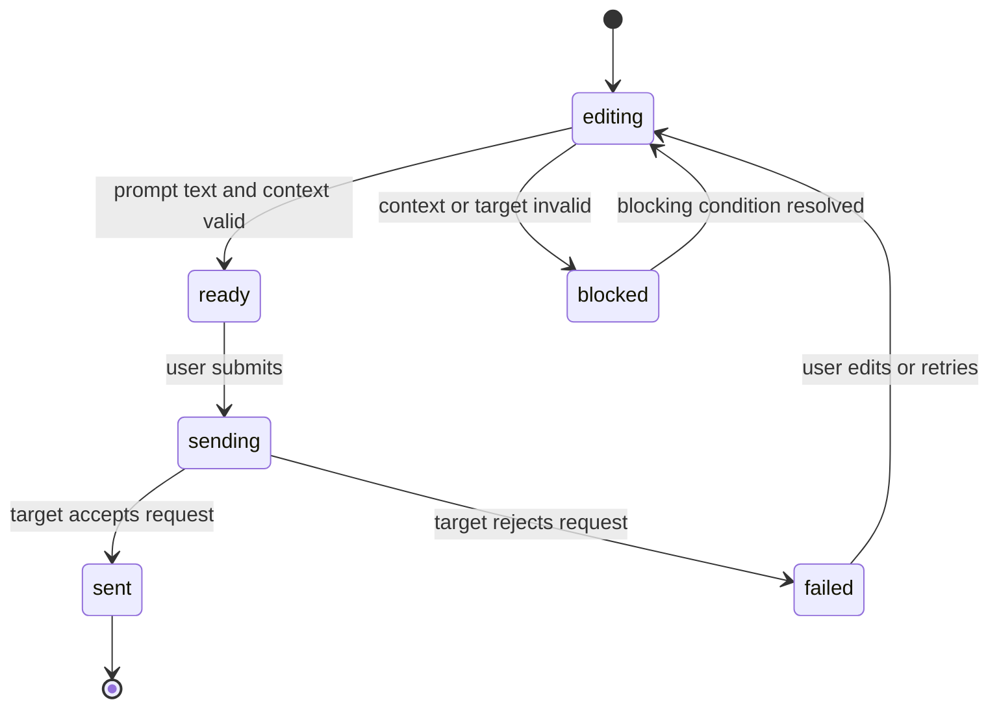

# Data Model: Markdown Quick Prompt

## QuickPromptScope

Quick prompt가 어떤 문서 범위를 첨부하는지 나타낸다.

**Fields**:

- `kind`: `selection` | `block` | `document`
- `label`: 사용자에게 표시되는 범위 이름
- `blockId`: `block` 또는 `selection`이 연결된 대표 Markdown block id
- `startLine`: 범위 시작 line
- `endLine`: 범위 종료 line
- `selectionOffsets`: selection 범위일 때 시작/종료 offset 목록

**Validation Rules**:

- `kind=selection`은 non-empty selected text가 있어야 한다.
- `kind=block`은 non-empty block raw content가 있어야 한다.
- `kind=document`는 non-empty document source가 있어야 한다.
- line range가 있으면 `startLine <= endLine`이어야 한다.

## QuickPromptContext

Agent prompt에 첨부되는 문서 context이다.

**Fields**:

- `id`: prompt draft 안에서 context를 식별하는 id
- `scope`: `QuickPromptScope`
- `sourceLabel`: 파일명 또는 문서 표시명
- `documentPath`: 표시 가능한 문서 경로
- `documentRevisionLabel`: 작성 UI를 연 시점의 문서 상태 표시값
- `content`: agent에게 전달할 Markdown source content
- `originalLength`: 축약 전 문자 수
- `includedLength`: 실제 포함 문자 수
- `lengthState`: `complete` | `reduced`
- `reductionReason`: context가 줄어든 이유

**Validation Rules**:

- `content.trim()`이 비어 있으면 전송 불가이다.
- `includedLength <= originalLength`여야 한다.
- `lengthState=reduced`이면 `reductionReason`이 사용자에게 표시되어야 한다.
- context는 이미 열린 문서 상태에서 생성되어야 하며, 전송 전 source label과 revision label이 preview에 남아야 한다.

## PromptDraft

사용자가 전송 전 편집하는 prompt 본문과 첨부 context 묶음이다.

**Fields**:

- `id`: draft id
- `context`: `QuickPromptContext`
- `promptText`: 사용자가 작성한 요청 본문
- `status`: `editing` | `ready` | `sending` | `sent` | `blocked` | `failed`
- `blockedReason`: 전송 불가 이유
- `createdAt`: 생성 시각
- `sentAt`: 전송 완료 시각

**Validation Rules**:

- `promptText.trim()`이 비어 있으면 `ready` 또는 `sending`으로 갈 수 없다.
- context가 empty/reduced-unconfirmed 상태이면 전송할 수 없다.
- agent target이 unavailable이면 `blocked` 상태와 reason을 표시해야 한다.

**State Transitions**:

## AgentTarget

PromptDraft를 받을 수 있는 현재 agent 대상이다.

**Fields**:

- `id`: 대상 식별자
- `label`: 사용자 표시 이름
- `availability`: `available` | `unavailable` | `busy`
- `unavailableReason`: 대상이 없거나 받을 수 없는 이유
- `ownerScope`: workspace/session/document owner scope 표시값

**Validation Rules**:

- `availability=available`인 대상만 즉시 전송 가능하다.
- `busy` 대상은 앱 정책에 따라 queue 또는 disabled 상태를 표시해야 한다.
- owner scope가 현재 문서/workspace와 맞지 않으면 전송하면 안 된다.

## QuickPromptActionState

Icon-only quick prompt 진입점의 표시/상호작용 상태이다.

**Fields**:

- `scopeKind`: `selection` | `block` | `document`
- `surface`: `selection-toolbar` | `block-toolbar` | `document-action`
- `enabled`: 실행 가능 여부
- `disabledReason`: 실행 불가 사유
- `tooltip`: hover/focus 설명
- `accessibleName`: 보조 기술용 이름

**Validation Rules**:

- icon-only button은 `accessibleName`이 있어야 한다.
- `scopeKind=selection`의 canonical surface는 `selection-toolbar`이며, non-empty selection이 있을 때 toolbar 안에 quick annotate 버튼이 표시되어야 한다.
- `enabled=false`이면 사용자에게 이유를 알 수 있는 tooltip 또는 nearby state가 있어야 한다.
- keyboard focus로 도달 가능해야 한다.

## QuickPromptDialogState

Quick annotate 버튼 실행 후 사용자 prompt 입력을 받는 다이얼로그 상태이다.

**Fields**:

- `open`: 다이얼로그 표시 여부
- `draft`: 현재 `PromptDraft`
- `submitLabel`: 전송 action 표시명
- `targetState`: 현재 `AgentTarget` availability snapshot

**Validation Rules**:

- quick annotate 버튼 클릭은 prompt text를 즉시 전송하지 않고, 먼저 `open=true` 상태의 다이얼로그를 만들어야 한다.
- 사용자가 입력한 `draft.promptText`가 비어 있지 않고 target/context가 유효할 때만 전송할 수 있다.
- 전송 payload는 dialog에 입력된 prompt text를 사용해야 하며 기본 prompt로 대체하면 안 된다.
